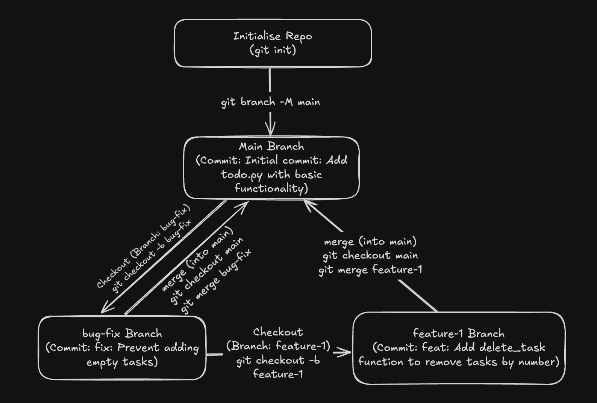

# **Git Workflow for Task Management Project**

## **Project Overview**
This project is a simple task management system developed with a structured Git workflow. Below is a step-by-step breakdown of how Git was used for version control.

---

## **Git Workflow**



### **1. Initialization**
- Initialized a Git repository:  
  ```sh
  git init
  ```  
- Set the default branch to `main`:  
  ```sh
  git branch -M main
  ```  
- Added the initial `todo.py` file:  
  ```sh
  git add todo.py
  ```  
- Committed the first version:  
  ```sh
  git commit -m "Initial commit: Add todo.py with basic functionality"
  ```  

---

### **2. Bug Fix (`bug-fix`)**
- Created a bug-fix branch from `main`:  
  ```sh
  git checkout main
  git checkout -b bug-fix
  ```  
- Fixed `add_task` to reject empty task entries.  
- Committed the fix:  
  ```sh
  git commit -m "fix: Prevent adding empty tasks"
  ```  

---

### **3. Feature Development (`feature-1`)**
- Created a new feature branch:  
  ```sh
  git checkout -b feature-1
  ```  
- Added `delete_task` functionality to allow task deletion.  
- Committed the changes:  
  ```sh
  git commit -m "feat: Add delete_task function to remove tasks by number"
  ```  

---

### **4. Merging Branches**  

- **Merging `bug-fix` into `main`**:  
  ```sh
  git checkout main
  git merge bug-fix
  ```
  _(No conflicts occurred.)_  

- **Merging `feature-1` into `main`**:  
  ```sh
  git merge feature-1
  ```
  _(No conflicts occurred in this case.)_  

- **Handling Merge Conflicts (if any)**:  
  If conflicts had occurred (e.g., overlapping changes to `add_task`), they would have been resolved manually by editing the file, staging it, and committing the resolved version:  
  ```sh
  git add todo.py
  git commit -m "fix: Resolve merge conflict in add_task function"
  ```

---

## **Current State**  
The `main` branch now contains:  
✅ **Bug fix** preventing empty tasks  
✅ **Task deletion feature** (`delete_task`)  

---
